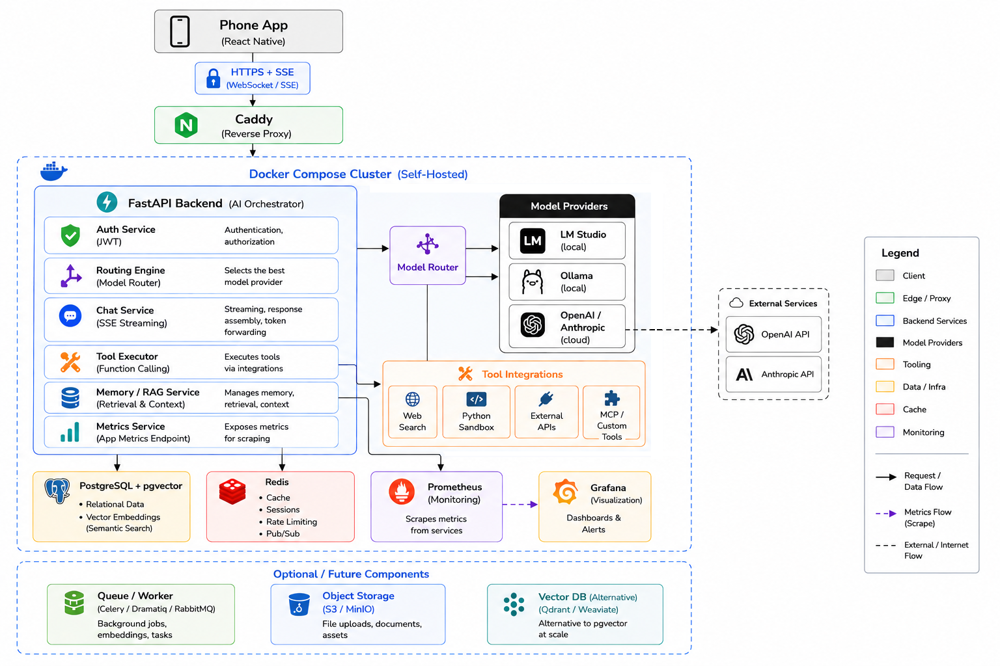

> **Status:** Stage 5 complete. Working on routing logic.
---

## What This Is

This project is an **inference orchestration layer** ie a backend system that sits between a mobile client and multiple AI model providers, handling routing, auth, persistence, memory, and observability. It is meant to be a personal mini-OpenRouter made with privacy in mind: You control the models, the routing logic, the data, and the infrastructure.

---

## Architecture



---

## Tech Stack

| Layer | Technology | Purpose |
|---|---|---|
| Local Inference | LM Studio | Runs local models, exposes OpenAI-compatible API |
| Backend | Python + FastAPI | Async API gateway, routing logic, streaming |
| Auth | JWT (python-jose) + bcrypt | User login, access + refresh tokens |
| Database | PostgreSQL + SQLAlchemy | Users, conversations, message history |
| Vector DB | pgvector | Semantic memory / RAG |
| Cache / Queue | Redis | Rate limiting, session cache, async jobs |
| Observability | Prometheus + Grafana | Latency, token/sec, throughput dashboards |
| Remote Access | Tailscale | VPN mesh — phone reaches laptop directly |
| Containers | Docker + Docker Compose | Packages every service cleanly |
| Reverse Proxy | Caddy | HTTPS termination, routes to FastAPI |
| Mobile | React Native + Expo | Cross-platform mobile client |
| Cloud Providers | OpenAI / Anthropic SDK | Optional routing targets alongside local models |

---

## Project Structure

```
multi-model-gateway/
├── .env                        
├── docker-compose.yml          # Orchestrates all services
├── backend/
│   ├── Dockerfile
│   ├── requirements.txt
│   └── app/
│       ├── main.py             # App entry point, middleware, router registration
│       ├── db.py               # Database settings            
│       ├── core/
│       │   ├── config.py       # Pydantic settings 
│       │   ├── security.py     # JWT creation and verification 
│       │   └── metrics.py      # Prometheus custom metrics (coming Stage 9)
│       ├── routers/
│       │   ├── chat.py         # POST /v1/chat/completions — SSE streaming
│       │   ├── models.py       # GET /v1/models — lists loaded LM Studio models
│       │   ├── auth.py         # POST /auth/register, /auth/login 
│       │   └── convo.py        # CRUD for conversation history 
│       ├── services/
│       │   ├── router.py       # Routing logic to decide on provider 
│       │   ├── streaming.py    # SSE streaming helpers
│       │   ├── memory.py       # pgvector embeddings + semantic recall
│       │   └── tools.py        # Tool registry and executor
│       └── models/
│           └── users.py        # SQLAlchemy database models           
│           └── messages.py
│           └── conversations.py
|                      
├── mobile/                     # React Native + Expo app (coming Stage 11)
├── caddy/
│   └── Caddyfile               # Reverse proxy config (coming Stage 10)
└── monitoring/
    ├── prometheus.yml           # Scrape config (coming Stage 9)
    └── grafana/                 # Dashboard definitions (coming Stage 9)
```

---

## What's Built So Far

### Stage 1: LM Studio Up and Running
- LM Studio server running on port `xxxx`
- OpenAI-compatible API working 

### Stage 2: Backend Gateway 
- FastAPI app containerized with Docker
- Auto-reloading development server via uvicorn `--reload`
- `GET /health` — health check endpoint
- `GET /v1/models` — proxies LM Studio's loaded model list
- `POST /v1/chat/completions` — SSE streaming chat endpoint
- Environment-based config via `pydantic-settings`
- CORS middleware configured
- Auto-generated interactive API docs at `/docs`

### Stage 3: Containerize PostgreSQL + Redis
- Add postgres and redis services to `docker-compose.yml`
- Confirm all three services communicate inside Docker network
- Add pgvector extension to postgres

### Stage 4: Auth System
- User registration and login endpoints
- Password hashing with bcrypt
- JWT access + refresh token flow
- Auth middleware protecting all chat endpoints
- Full flow: register > login > token > authenticated chat

### Stage 5: Conversation Persistence
- SQLAlchemy database models: User, Conversation, Message
- Alembic migrations
- Save every message exchange to PostgreSQL
- Load conversation history and pass it to LM Studio for context
- CRUD endpoints: create, list, fetch, delete conversations

### Stage 6: Routing Engine
- `services/router.py` — the brain of the gateway
- Privacy-aware routing: sensitive requests are to be sent to local models
- Task-aware routing: vision tasks to Gemini, coding tasks to OpenRouter Models
- Multi-provider support: LM Studio, OpenRouter, Ollama, ComfyUI and in future OpenAI, Anthropic, 
- Provider override via request flag

## What's Coming:

### Stage 7 — Semantic Memory (RAG)
- Generate embeddings for every message using local embedding model
- Store embeddings in pgvector
- On each new message, recall semantically similar past messages
- Inject recalled context into system prompt
- Cross-conversation memory retrieval

### Stage 8 — Tool Calling
- Tool registry with definitions and handlers
- Tools: calculator, weather, web search
- Detect when model returns a tool call
- Execute handler, return result to model
- Model generates final response with tool data

### Stage 9 — Observability
- Prometheus metrics endpoint auto-exposed
- Custom metrics: requests per provider, latency histogram, tokens/sec gauge
- Grafana dashboards: request rate, latency percentiles, token throughput
- Per-model and per-provider breakdown

### Stage 10 — Networking + Reverse Proxy
- Caddy reverse proxy for HTTPS termination
- Phone reaches backend via Tailscale IP from anywhere

### Stage 11 — Mobile App via React Native + Expo 
- Auth screens: Login, Register
- Home screen: conversation list
- Chat screen: real-time SSE token streaming
- Model/provider selector
- End-to-end test: phone via Tailscale > backend > LM Studio > streamed output

### Stage 12 — Polish
- Rate limiting via Redis
- Request logging to PostgreSQL (user, provider, model, latency, tokens)
- Unit tests for routing logic and auth
- Architecture diagram
- Clean GitHub commit history

---

## Running Locally

**Prerequisites:**
- Docker Desktop
- LM Studio running with at least one model loaded, server started on port `xxxx`
- Tailscale installed (optional for remote access)

**Setup:**

1. Clone the repo
2. Create a `.env` file at the root:
```
LM_URL=http://host.docker.internal:xxxx/v1
LM_DEFAULT_MODEL=model-name

DATABASE_URL= add a postgres db url
REDIS_URL= add a redis url

SECRET_KEY= add secret key for jwt
ALGORITHM= choose algo for hashing
ACCESS_TOKEN_EXPIRY_MINUTES= set token expiry
```

3. Start the backend:
```bash
docker compose up --build
```

4. Verify:
- Health check: `http://localhost:xxxx/health`
- API docs: `http://localhost:xxxx/docs`

---

## Environment Variables

| Variable | Description |
|---|---|
| `LM_URL` | LM Studio server base URL | 
| `LM_DEFAULT_MODEL` | Default model identifier |
| `DATABASE_URL` | PostgreSQL connection string | 
| `REDIS_URL` | Redis connection string | 
| `SECRET_KEY` | JWT signing secret key | 
| `OPENAI_API_KEY` | OpenAI key (optional) | 
| `ANTHROPIC_API_KEY` | Anthropic key (optional) | 


---

